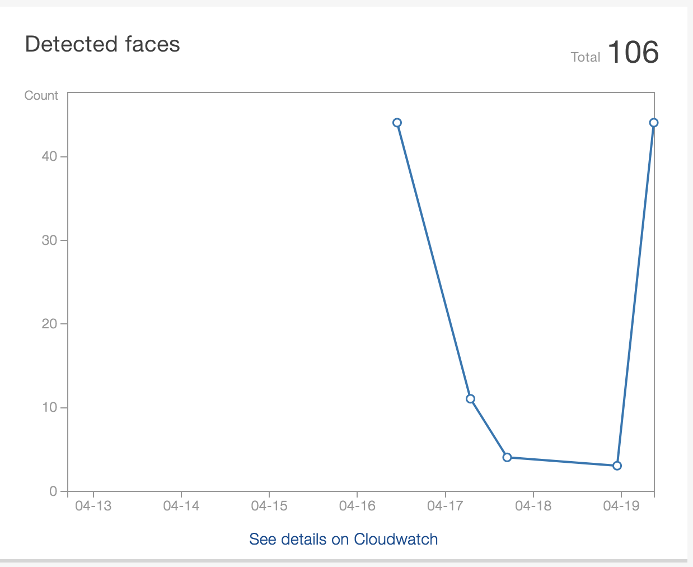
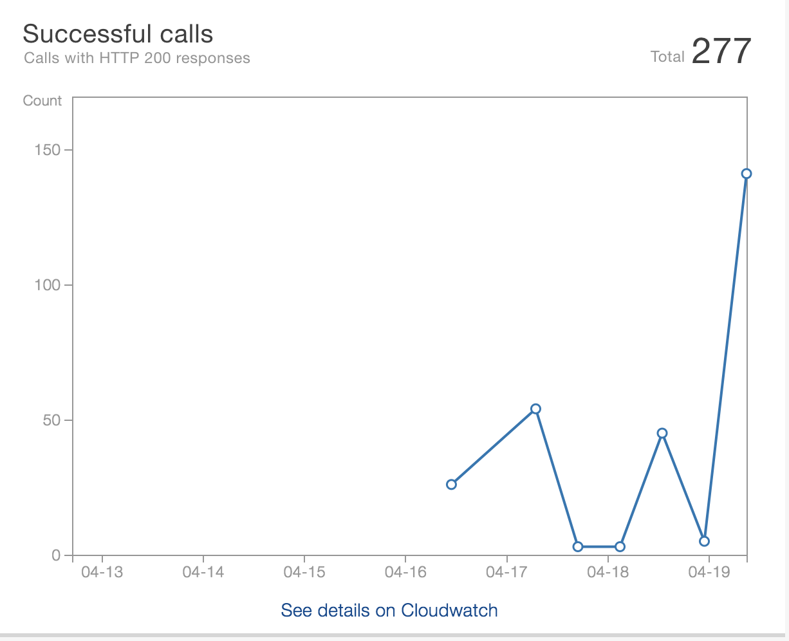
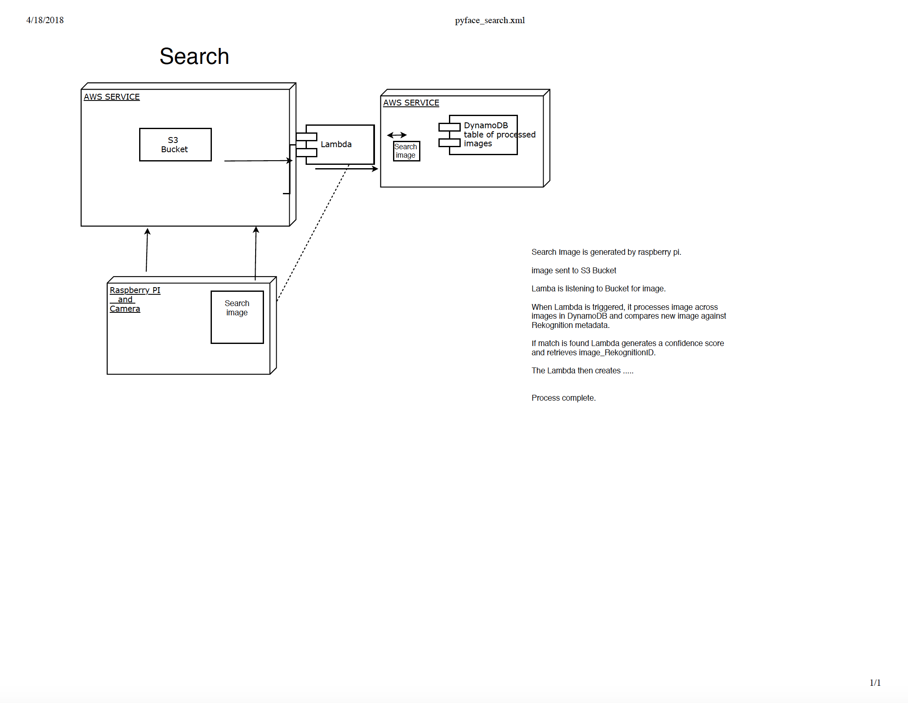
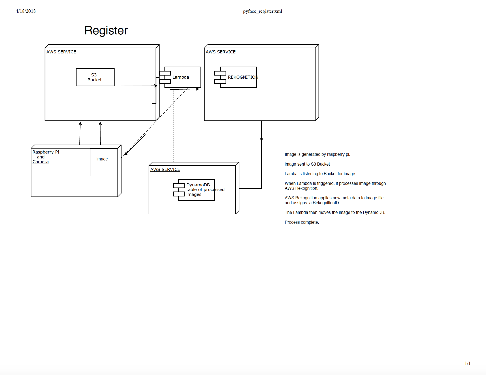

# Project Pyface

**Author** : Jay Adams, Tyler Fishbone, Jeremy Crawford, Ramon Mendoza

**Version**: 1.0.0

## Introduction & Innovation
Pyface is a face-recognition platform that can be used to authenticate users for a multitude of different uses. Need to take attendance for class and know when students are showing up? Want to restrict access to your ‘secret lair’? Log employees in and out of work? By leveraging Amazon AMS Rekognition software, you can easily authenticate people that exist in your personal database by simply taking their picture, and just as easily increase that secret lair access by adding new people through exclusive ‘admin’ rights.

## Technical Details

### Architechture
Python 3.6.4
MariaDB database hosted on the Raspberry Pi 3

### API
AWS services
AWS Rekognition
AWS DynamoDB
AWS S3

### Hardware Utilized
Raspberry Pi 3 w/ Raspbian
Keyboard
Mouse
Monitor/Display
Camera
Breadboard
3 LEDs - Red, Yellow, Green
Button
Connection Wires

## Programs/Services Required
Python 3.7
Raspbian
AWS Rekognition
AWS S3
AWS Lambda
AWS Dynamo DB
AWS API Gateway
PostgreSQL
TKinter

### AWS Rekognition
Amazon Rekognition makes it easy to add image and video analysis to your applications. You just provide
an image or video to the Rekognition API, and the service can identify objects, people, text, scenes, and
activities. It can detect any inappropriate content as well. Amazon Rekognition also provides highly
accurate facial analysis and facial recognition. You can detect, analyze, and compare faces for a wide
variety of use cases, including user verification, cataloging, people counting, and public safety.

### Functionality
Pyface relies on two primary functions to operate, a SearchFaces Lambda and a RegisterFaces Lambda. Both of these Lambdas operate with AWS Rekognition.

### SearchFaces 
SearchFaces is invoked every time you take a picture when you are not in ‘Admin’ mode. When invoked, SearchFaces takes a picture of the subject and passes it to S3, where it is processed through Lambda and sent to Rekognition. In Rekognition, it compares the face in the picture to all users. If a match is found, a green light comes on. If not match is found, a red light comes on. Every time a successful event occurs, the user is logged to a local database for future use.

### RegisterFaces 

RegisterFaces is only invoked when in ‘Admin’ mode, and allows the Administrator to access a TKinter window that allows them to input user information, as well as a picture of the subject. That information is then sent to an S3 bucket, where it is indexed and added to a DynamoDB database, as well as a local database for future use.

#### Workflows


## Resources

https://softwaremill.com/access-control-system-with-rfid-and-amazon-rekognition/

https://kennbrodhagen.net/2016/03/09/how-to-return-a-custom-error-object-and-status-code-from-api-gateway-with-lambda/

https://github.com/aws/aws-iot-device-sdk-python

https://gist.github.com/alexcasalboni/0f21a1889f09760f8981b643326730ff

https://aws.amazon.com/blogs/machine-learning/build-your-own-face-recognition-service-using-amazon-rekognition/

https://docs.python.org/3.6/library/tkinter.html

http://www.tkdocs.com/tutorial/install.html

https://wiki.python.org/moin/TkInter